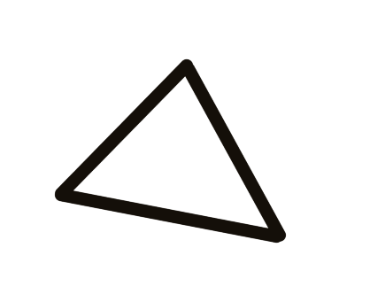
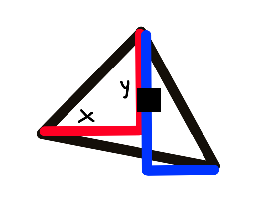
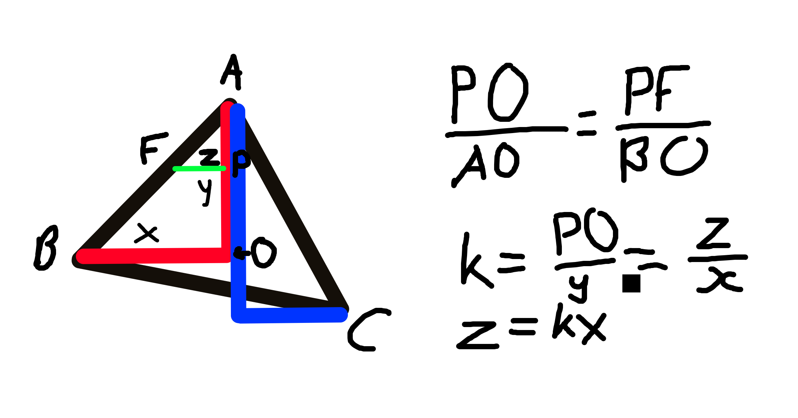
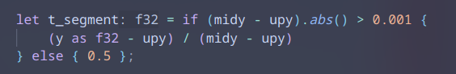

# Simple Rasterizer

## Overview
A rasterizer is an algorithm that converts vector graphics (triangles) into raster images (pixels). My Rust implementation uses the efficient **Scanline Algorithm**.

## Algorithm Explanation

### Core Concept
The scanline algorithm processes triangles line by line from top to bottom, calculating horizontal segments to fill.

### Visual Steps

1. **Input Triangle**
   

2. **Coordinate System**
   

3. **Edge Calculation**
   

4. **Pixel Interpolation**
   

The `z` value represents the number of pixels to draw along each horizontal segment.

## Implementation Steps

```rust
// Pseudocode
fn rasterize_triangle(v0: Vec2, v1: Vec2, v2: Vec2, color: Color) {
    // 1. Sort vertices by Y coordinate (top to bottom)
    let sorted_verts = sort_vertices_by_y([v0, v1, v2]);
    
    // 2. Split triangle into top and bottom parts
    let (top, bottom) = split_triangle(sorted_verts);
    
    // 3. Process top half
    for y in top.start_y..=top.end_y {
        let left_x = calculate_left_edge(y, top);
        let right_x = calculate_right_edge(y, top);
        draw_scanline(y, left_x, right_x, color);
    }
    
    // 4. Process bottom half  
    for y in bottom.start_y..=bottom.end_y {
        let left_x = calculate_left_edge(y, bottom);
        let right_x = calculate_right_edge(y, bottom);
        draw_scanline(y, left_x, right_x, color);
    }
}
```

### Key Operations
- **Sort vertices** by Y coordinate
- **Calculate edge slopes** using Bresenham's algorithm or linear interpolation
- **Compute left and right boundaries** for each scanline
- **Draw horizontal lines** between boundaries
- **Repeat** for all scanlines covering the triangle

## Use Cases
- Software rendering engines
- Educational purposes
- Embedded systems without GPU
- Reference implementations for hardware design